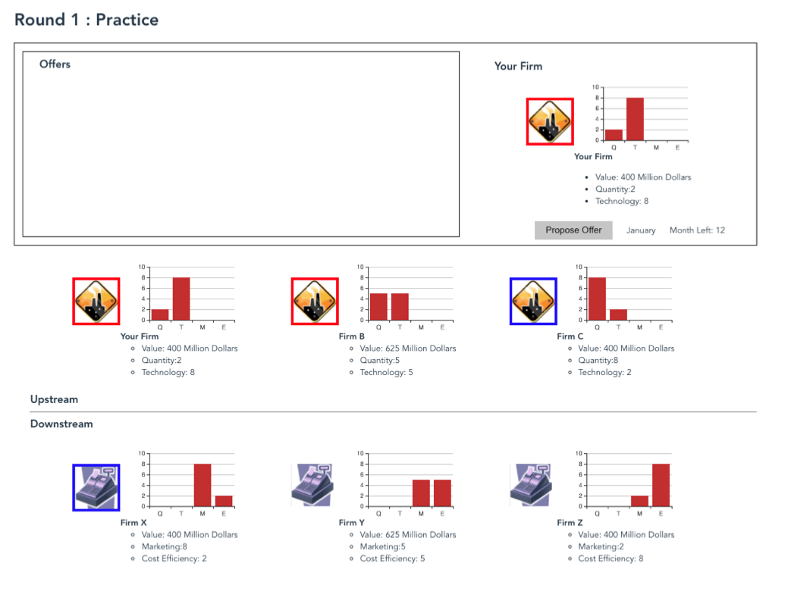
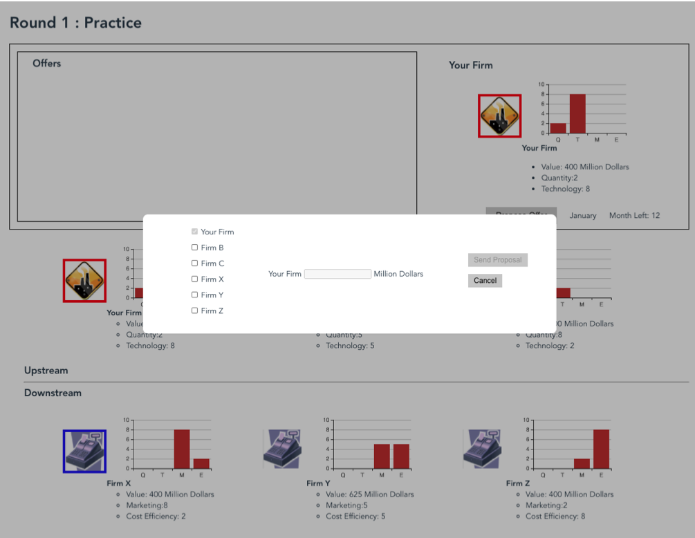
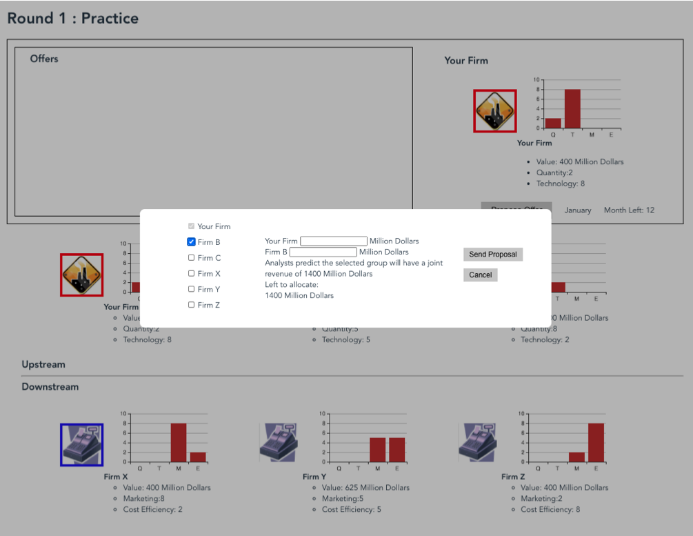
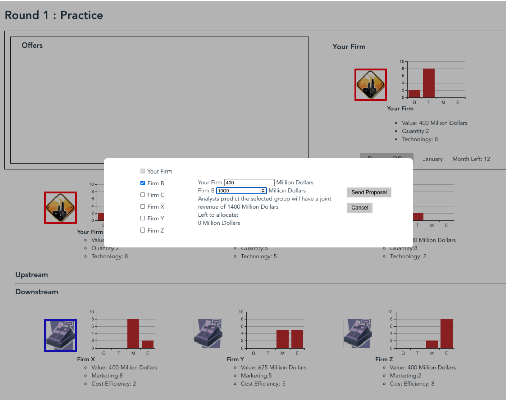

# The Strategic Coalition Game

## Background
Cooperation and competition among firms is a common feature in many industries. Alliances leverage a firm's unique skills with the specialized resources of its partners to create a more potent force in the marketplace. 

## Game Scenario
This game is build for investigate how and why firms may or may not choose to form coalitions with other firms. User will manage a focal firm in a computer simulated six firm industry, and he will participate in a series of games consisting of multiple negotiation rounds between firms competing in the industry. User's goal is to maximize thier firm's individual expected profit, while keeping in mind that other firms have similar goals. 

## Game Interface

### Game Interface

### Propose Offer

### Select Firm

### Allocate Revenue

### Send Proposal 

